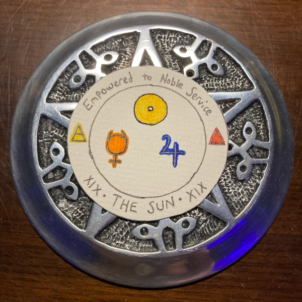

# towardtheabyss Sigil Guide

* [Layout](#layout)
* [Guide](#guide)
    * [Planetary](#planetary)
    * [Elemental](#elemental)
        * [Polarities](#polarities)
        * [Dignities](#dignities)
* [References](#references)

## Layout

* **Intention Motto**: Placed in the upper banner of the sigil, and used to infuse an intention.
* **Elemental Energy**: Placed along the banner sides of the sigil; indicates elemental energies charged into the sigil. This can be the same element twice, or two elements. Be sure to consider the [Elemental Dignities](#dignities) when selecting elements.
* **Tarot / Oracle Representation**: Placed along the bottom banner of the sigil. This is a tarot or oracle card that divines additional intent. Can either be hand selected, or pulled at random.
* **Planetary Energy**: Placed in the center of the sigil; indicates planetary energies charged into the sigil. Can consist of all planetary energy relevant to the intention.

## Guide

The following section is just a guide that's helpful for me. It should not limit or cause conflict with the way you perceive planetary or elemental energies. One thing magick has taught me is that this journey is highly personal, and it is important to find what works for you.

### Planetary

Symbol | Name | Principle | Urges | Needs
-------|------|-----------|-------|------
 | **Sun** | Vitality; Sense of individuality; Creative energy, radiant inner self (attunement of soul); Essential values | Urge to be and to create | Need to be recognized and to express self
 | **Moon** | Reaction; Sub-conscious predisposition; Feeling about self (self-image); Conditioned responses | Urge to feel inner support; domestic and emotional security urge | Need for emotional tranquility and sense of belonging; need to feel right about self
 | **Mercury** | Communication; Conscious mind (i.e. - logical or rational mind) | Urge to express one's perceptions and intelligence through skill or speech | Need to establish connections with ohters; need to learn
 | **Venus** | Emotionally-colored tastes; Values; Exchange of energy with others through giving of self and receiving from others; Sharing | Social and love urge; Urge to express affections; Urge for pleasure | Need to feel close to another; Need to feel comfort and harmony; Need to give of self's emotions
 | **Mars** | Desire; Will toward action; Initiative; Physical energy; Drive | Self-assertive and aggressive urge; Sex urge; Urge to act decisively | Need to achieve desires; Need for physical and sexual excitement
 | **Jupiter** | Expansion; Grace | Urge toward a larger order or to connect self with something greater than self | Need for faith, trust, and confidence in life and self; Need to improve self
 | **Saturn** | Contraction; Effort | Urge to defend self's structure and integrity; Urge toward safety and security through tangible achievement | Need for social approval; Need to rely on one's own resources and work
 | **Uranus** | Individualistic freedom; Freedom of ego-self | Urge toward differentiation, originality, and independence from tradition | Need for change, excitement, and expression without restraint
 | **Neptune** | Transcendent freedom; Unification; Freedom from ego-self | Urge to escape from the limitations of one's self and of the material world | Need to experience a oneness with life, a complete merger with the whole
 | **Pluto** | Transformation; Transmutation; Elimination | Urge toward total rebirth; Urge to penetrate to the core of experience | Need to refine self; Need to let go of the old through pain

### Elemental

Symbol | Element | Tarot | Polarity | Characteristics
-------|---------|-------|----------|----------------
 | Fire | Wands | `Active` | energy, passion, action, inspiration, drive, ambition, willpower
 | Water | Cups | `Passive` | emotions, feelings, relationships, intuition, love, serenity, spirituality
 | Air | Swords | `Active` | logic, ideas, intellect, communication, conflict, awareness, perception
 | Earth | Pentacles | `Passive` | physical, nature, health, stability, reliability, finances, practicality

#### Polarities

Active | Passive
-------|--------
Changes one's environment | Adapts to environment
Focuses energy outward | Focuses energy inward
Direct | Indirect
Extroverted | Introverted
Active | Reactive

#### Dignities

Elemental interactions:

* If they are the same suit, they **strengthen** each other
* Fire and Air are active, they **support** each other
* Water and Earth are passive, they **support** each other
* Fire and Water are enemies, they **weaken** each other
* Air and Earth are enemies, they **weaken** each other
* Fire and Earth are **neutral** to each other
* Water and Air are **neutral** to each other

There are 4 different types of relationships, which break down into the following:

* **Strengthen**: Increases the intensity of the elements. It amplifies both their positive and negative qualities.
* **Support**: These elements have a collaborative relationship. They build one another up.
* **Weaken**: These element cancel each other out. They decrease the effectiveness of each element.
* **Neutral**: They don't affect one another. 

## References

* [Astrology - The Ten Planets](https://www.astrology.com.tr/planets.asp)
* [Labyrinthos - Tarot Elements Correspondences and Working with Elemental Dignities]()